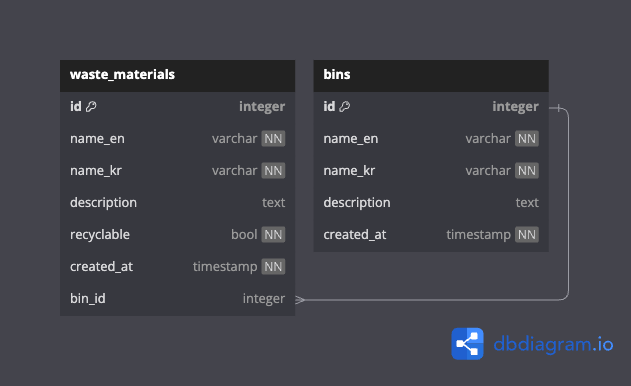

# binbuddykorea-api
[](https://github.com/astral-sh/ruff)
[](https://www.python.org/downloads/release/python-312/)

## Project setup

- Clone project via CLI: `git clone git@github.com:stephane-rbn/binbuddykorea-api.git`
- Enter project folder: `cd binbuddykorea-api`

> **Note:** This project does not use Docker yet but it will be added in the future. For now, you need to have Python and PostgreSQL installed on your machine.

### Install dependencies using [Pipenv](https://github.com/pypa/pipenv) and Pipfile

> Pipenv is required to install project dependencies based on the Pipfile. However, you can install and use your own Python's interpreter and run `pipenv install --deploy --system` to install dependencies only without creating a virtual environment with Pipenv (you still may need to create one manually with [virtualenv](https://virtualenv.pypa.io/en/latest/) or [venv](https://docs.python.org/3/library/venv.html)).

- Install pip on your machine (on Windows, you might need to install the exact version of Python that is used in the project: [Python 3.12.2](https://www.python.org/downloads/release/python-3122/))
- Install Pipenv via pip: `pip install pipenv` (on macOS, you can install Pipenv via [homebrew](https://brew.sh/): `brew install pipenv`)
- Install project dependencies based on Pipfile: `pipenv install`
- Activate the virtual environment: `pipenv shell` (to deactivate a virtual environment: `exit`)

### Setup PostgreSQL database
- Install PostgreSQL on your machine (you can use [Postgres.app](https://postgresapp.com/) on macOS)
- Create a new database called "binbuddykorea-dev" (you can use [pgAdmin](https://www.pgadmin.org/download/) to create a new database)
- Create a new `.env` file in the root of the project and add the following environment variables:
  ```bash
  DB_USER=postgres # or the user you use to connect to your database
  DB_PASSWORD=root # or the password you use to connect to your database
  DB_HOSTNAME=localhost # or the hostname you use to connect to your database
  DB_PORT=5432 # or the port you use to connect to your database
  DB_NAME=binbuddykorea-dev # or the name of the database you created
  DISPLAY_SQL_LOGS=true # or false to disable SQL logs like in production environment
  ENV_TEST=true # or false to disable actions only available in development environment
  ```
- Run the database migrations to build the database schema: `alembic upgrade head`
- Optional: run `python seeds.py` to seed the database with initial data (only available in development environment)
- Finally, you can run the project using the following command: `uvicorn main:app --reload`

That's it. You're ready to go! ✅

### API Database Diagram ([link to project](https://dbdiagram.io/d/BinBuddyKorea-API-65ddbb645cd0412774e91ee1))



### Code conventions

- Use [ruff](https://github.com/astral-sh/ruff) for code linting and formatting
