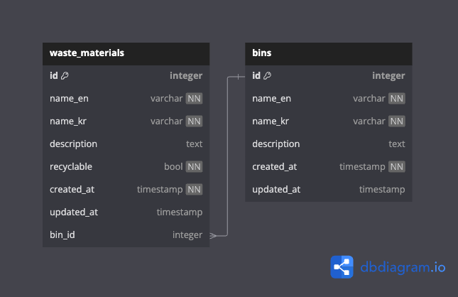

# binbuddykorea-api

## Project setup

- Clone project via CLI: `git clone git@github.com:stephane-rbn/binbuddykorea-api.git`
- Enter project folder: `cd binbuddykorea-api`

### Install dependencies using [Pipenv](https://github.com/pypa/pipenv) and Pipfile

- On macOS, you can install Pipenv via [homebrew](https://brew.sh/): `brew install pipenv`
- (If python is already globally installed on your machine, you can also run `pip install pipenv` instead)
- Install project dependencies based on Pipfile: `pipenv install`
- Activate virtual environment: `pipenv shell` (to deactivate a virtual environment: `exit`)
- Run the app: `uvicorn main:app --reload`

That's it. You're ready to go! ✅

If needed, you can also install additional dependencies using pipenv. For example:
- Install additional dependencies: `pipenv install <package-name>`
- Install additional development dependencies: `pipenv install --dev <package-name>`

### API Database Diagram ([link to project](https://dbdiagram.io/d/BinBuddyKorea-API-65ddbb645cd0412774e91ee1))

### Code conventions

- Use [ruff](https://github.com/astral-sh/ruff) for code linting and formatting.
